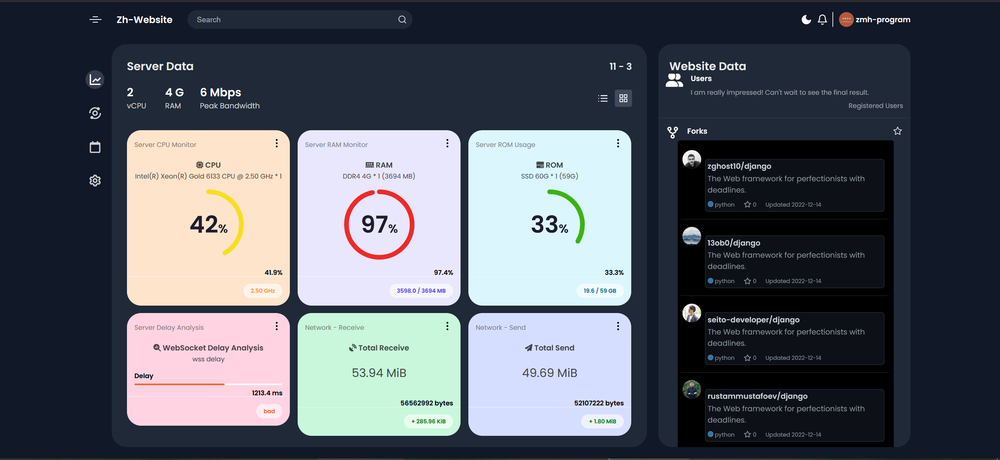
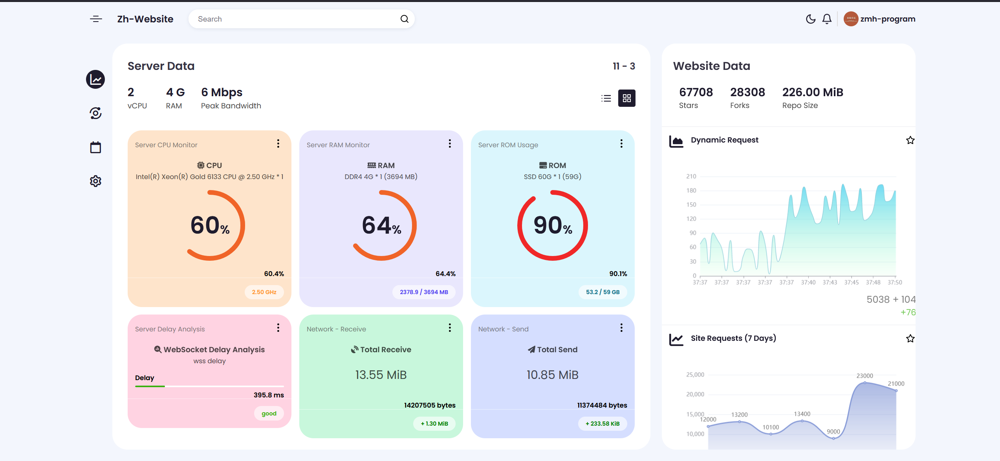
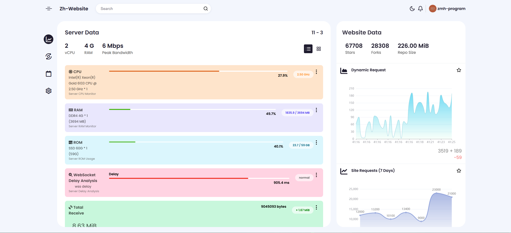
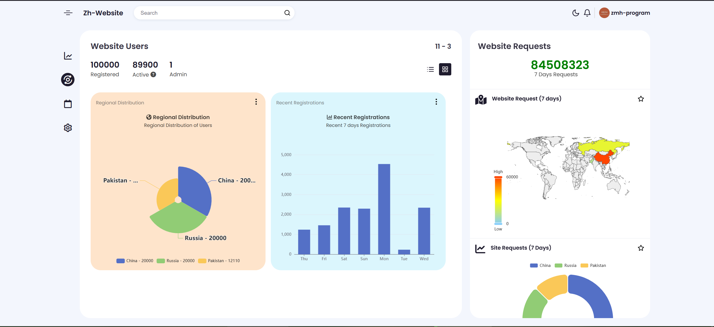
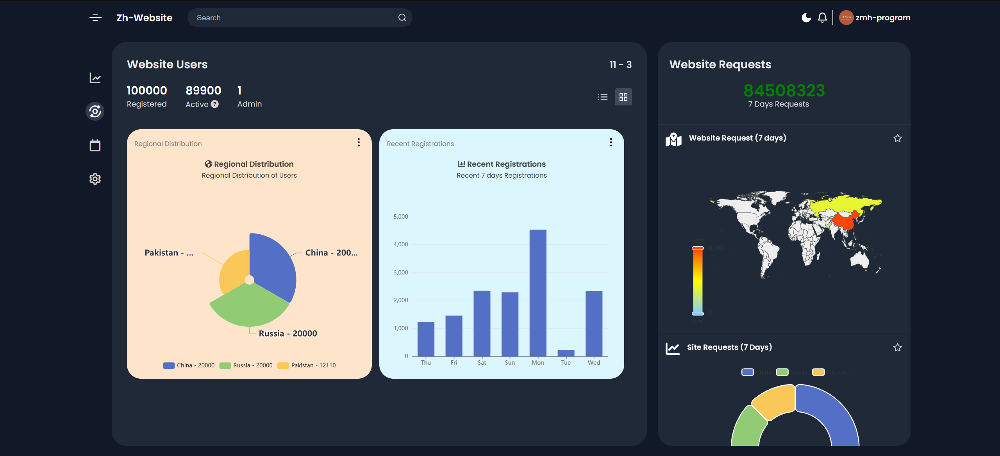
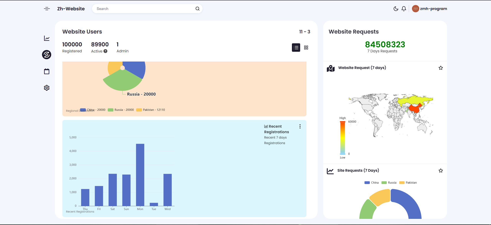

<div align="center">

### 🥗
# [Admin Pages](https://admin-pages.deeptrain.net)

### Frontend administrator interface, using native html/css/js
### 一个原生前端管理员界面

</div>

## ScreenShot | 预览








## API | 接口

###### index.html / line: 372
```html
<script>
    updateSiteRequestChart([12000, 13200, 10100, 13400, 9000, 23000, 21000]);
    setInterval(
        function (){
            updateDynamicRequestChart(Math.round(Math.random() * 100) + 100);
        },
        500,
    );
    setInterval(function (){roundProgressUpdate(cpu_progress_dom, (Math.random() * 100).toFixed(1));}, 1000);
    setInterval(function (){roundProgressUpdate(ram_progress_dom, (Math.random() * 100).toFixed(1));}, 1000);
    setInterval(function (){roundProgressUpdate(rom_progress_dom, (Math.random() * 100).toFixed(1));}, 1000);
    setInterval(function (){wsProgressUpdate((Math.random() * 2000).toFixed(1));}, 1000);
    initGithubRepositoryData("django", "django");
    setInterval(function (){recv.update(Math.random() * 2000000);}, 1000);
    setInterval(function (){send.update(Math.random() * 2000000);}, 1000);
</script>
```
###### geoip.html / line: 190
```html
<script>
    initializeRequestCharts("static/data/world.json", "static/data/data.json");
</script>
```
