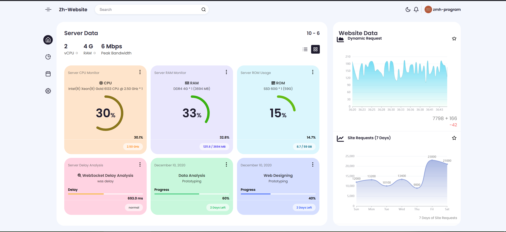

# admin-pages

Front-end administrator interface, using native html/css/js

#### Preview Online [Admin Pages](https://zmh-program.github.io/admin-pages/)

#### ScreenShot



feature videos:

[admin](assets/admin.mp4)

[features](assets/features.mp4)

###### setup

```html
<script>
    updateSiteRequestChart([12000, 13200, 10100, 13400, 9000, 23000, 21000]);
    setInterval(
        function (){
            updateDynamicRequestChart(Math.round(Math.random() * 100) + 100);
        },
        500,
    );
    setInterval(function (){roundProgressUpdate(cpu_progress_dom, (Math.random() * 100).toFixed(1));}, 1000);
    setInterval(function (){roundProgressUpdate(ram_progress_dom, (Math.random() * 100).toFixed(1));}, 1000);
    setInterval(function (){roundProgressUpdate(rom_progress_dom, (Math.random() * 100).toFixed(1));}, 1000);
    setInterval(function (){wsProgressUpdate((Math.random() * 2000).toFixed(1));}, 1000);
    initGithubRepositoryData("django", "django");
</script>
```
